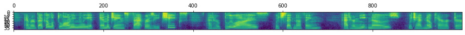
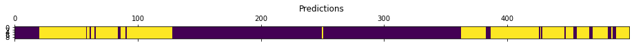
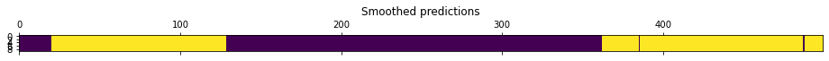
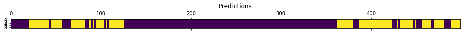
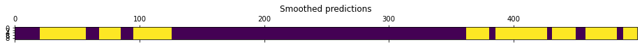

# Voice Activity Detection

## 1. Installation

```
$ conda create -n vad python=3.9
$ conda activate vad
$ git clone https://github.com/curly1/voice-activity-detection.git
$ cd voice-activity-detection/
$ pip install -r requirements.txt
```

## 2. Tools used

The goal of the project was to develop a Voice Activity Detection system using Neural Networks. Main tools used in the project:

- [Lhotse library](https://github.com/lhotse-speech/lhotse) for data preparation and data augmentation;
- PyTorch for NN modelling;
- scikit-learn and matplotlib for analysing and visualising the results.

## 3. How to use this repo

- Run the preprocessing script. 

    ```python preprocessing/extract_and_store_features.py --data-dir "vad_data" --data-augment True```

    `data-dir` is the folder with wav and corresponding json files. 
    
    `data-augment` indicates whether to use data augmentation or not.


- [Optional] Run the data exploration notebook.

    `evaluation/vad_data.ipynb`

- Run the model training notebook.

    `trainining/train.ipynb`

- Run the inference notebook.

    `inference/inference.ipynb`

## 4. Overall system description

First, an 80-dimensional feature vector (FBANK features) is extracted for every frame of the acoustic signal. By default, a frame is of length 25 ms and the frame shift is 10 ms. An example of the input features and the corresponding VAD labels is shown below. Yellow corresponds to voiced frames.




A simple DNN is then trained to classify if the acoustic feature vector is voiced or not. Optionally, data augmentation, i.e. speed and volume perturbation and adding reverberation, can be performed before training. 

Before training, the dataset is shuffled and split into train/dev/eval sets with 0.8/0.1/0.1 ratio. The reults for the eval set are briefly presented in the next section. Before evaluating the results, the predictions are smoothed, the hangover scheme is also added, as well as minimum speech duration threshold.

## 5. Evaluation

a) Without data augmentation.

>Total duration (hours): 3.3

>Speech duration (hours): 2.6 (80.6%)

```
              precision    recall  f1-score   support

         0.0       0.81      0.86      0.84     24666
         1.0       0.96      0.95      0.96     95019

    accuracy                           0.93    119685
   macro avg       0.89      0.91      0.90    119685
weighted avg       0.93      0.93      0.93    119685
```

An example for selected 500 frames from the eval set:





Yellow corresponds to speech.

b) With data augmentation.

> Total duration (hours): 16.5

> Speech duration (hours): 13.3 (80.6%)


```
              precision    recall  f1-score   support

         0.0       0.69      0.91      0.78     24666
         1.0       0.97      0.89      0.93     95019

    accuracy                           0.90    119685
   macro avg       0.83      0.90      0.86    119685
weighted avg       0.92      0.90      0.90    119685
```

An example for selected 500 frames from the eval set:





Yellow corresponds to speech.

## 6. Future work

Data and features

- [ ] Use a bigger dataset
- [ ] Further explore data augmentation
- [ ] Loudness normalisation, feature normalisation
- [ ] Use alternative input representations, combination of features, or raw waveform for an end-to-end framework


Evaluation

- [ ] Evaluation for noisy data (artificially add noise to the same recordings to test the robustness to real-world noise environments)
- [ ] Evaluation for recordings captured with different microphones (microphone distance variation)
- [ ] Improve analysis of the results, e.g. ROC curve
- [ ] Evaluate smoothing performance
- [ ] Performance comparison with different VAD tools, e.g. WebRTC
- [ ] Better logging for experiments (e.g. Weights and Biases)

Modelling

- [ ] Use a more powerful classifier
- [ ] Hyperparameter tuning, different optimizers and regularization approaches
- [ ] Use more output classes
- [ ] Mixture of experts
- [ ] Early stopping
- [ ] Multi-resolution representation learning (MultiOctConv)

Deployment and software
- [ ] Implement real-time inference for low latency
- [ ] Write tests
- [ ] Use Docker
- [ ] CI/CD
- [ ] Export the model to ONNX


## 7. References

[1] Graf, S., Herbig, T., Buck, M. et al. Features for voice activity detection: a comparative analysis (2015). EURASIP J. Adv. Signal Process. 2015, 91.

[2] Kola, J., Espy-Wilson, C., Pruthi, T. (2011) Voice Activity Detection. MERIT BIEN 2011 Final Report.

[3] Xu, X., Dinkel, H., Wu, M., Yu, K. (2021) A Lightweight Framework for Online Voice Activity Detection in the Wild. Proc. Interspeech 2021.